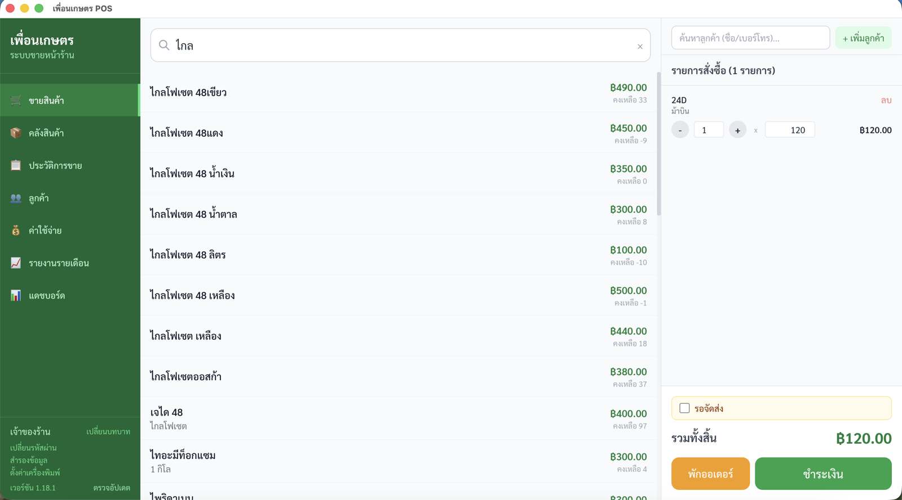
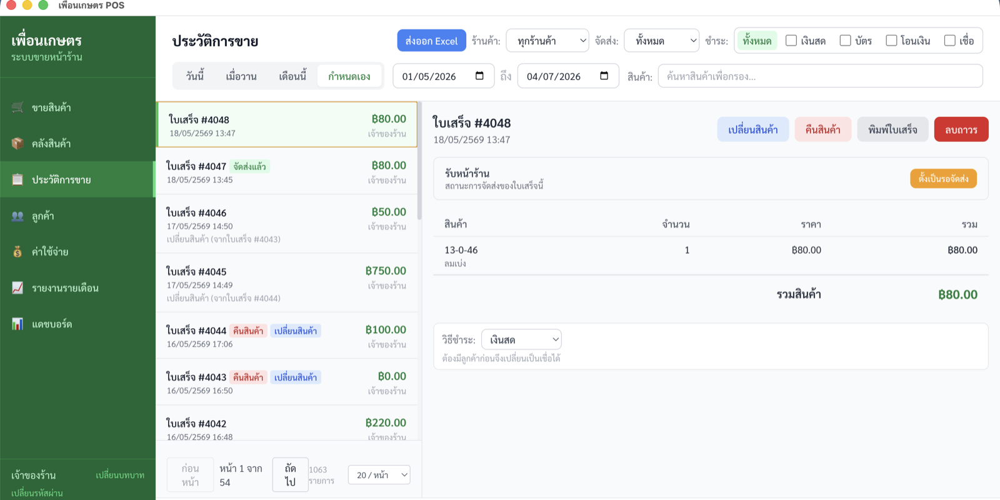
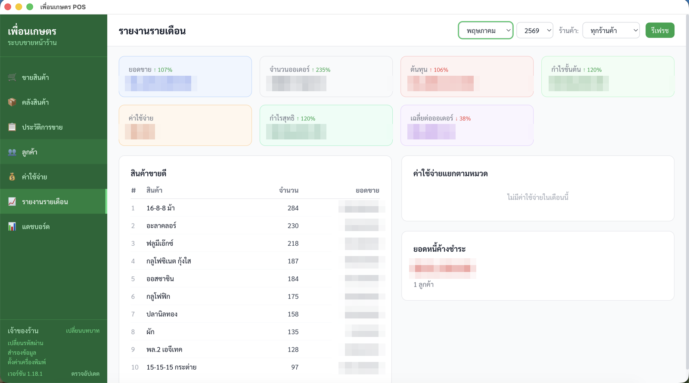

# เพื่อนเกษตร POS (Pueankaset POS)

**A point-of-sale desktop app for an agricultural supply shop in Thailand — built solo, and used in production every day since March 2026.**

[](https://github.com/Jppnp/pueankaset/actions/workflows/ci.yml)
[](https://github.com/jppnp/pueankaset/releases)



*The sales counter: fast Thai product search, cart with quantity/price editing, parked orders, and checkout.*


*Sales history: date/store/payment filters and per-receipt refund · exchange · reprint actions — 1,000+ receipts in a single month of real use.*


*Monthly report: month-over-month revenue and profit, top-selling products, expense breakdown, and outstanding customer debt. (Figures blurred — it's a real business.)*

## Why this exists

My family runs an agricultural supply shop (fertilizer, seeds, farm chemicals) in Thailand. Sales were tracked on paper: no stock counts, no daily totals, and customer credit ("จดไว้ก่อน" — *put it on my tab*) lived in a notebook.

I built Pueankaset POS to replace that. It is not a demo project — my dad uses it at the counter every day. That constraint shaped every engineering decision:

- **It must never lose a sale** → all money-touching operations (sales, refunds, exchanges) run inside SQLite transactions.
- **It must survive my mistakes** → versioned database migrations, automatic backups on every launch, and an auto-updater so fixes reach the shop without me driving there.
- **It must be usable by a non-technical shopkeeper** → Thai-language UI, Buddhist Era dates, Baht formatting, big touch-friendly buttons, and a one-keystroke checkout flow.

## Features

- **Sales counter** — fast product search, cart, parked orders (suspend a sale while serving another customer), keyboard-driven checkout, receipt printing to a thermal printer
- **Customer credit (store tab)** — credit sales tracked per customer, debt balances, repayment recording; refunds on credit sales automatically offset the debt
- **Refunds & exchanges** — partial or full returns that restore stock atomically; exchanges compose a refund + a new sale and record the price difference
- **Inventory** — stock tracking with automatic decrement on sale, low-stock alerts, soft-delete so historical sales keep referential integrity, CSV import
- **Multi-store** — products, sales history, and profit reports filterable per store
- **Card payment fees** — configurable surcharge (default 5%, rounded up to the nearest 10 baht) applied at checkout and itemized on the receipt
- **Analytics** — daily dashboard (revenue trend, top products, low stock) and monthly report (sales, expenses, profit, outstanding debt)
- **Expenses** — categorized shop expense tracking, summarized alongside revenue
- **CSV export** — sales, products, expenses, and customer debt, with UTF-8 BOM so Thai text opens correctly in Excel
- **Auth** — owner/employee roles; owner actions gated by an scrypt-hashed password with rate-limited verification
- **Operations** — automatic SQLite backups on launch, manual backup/restore, auto-update via GitHub Releases

## Architecture

Three-process Electron app (electron-vite), with a strict boundary between UI and data:

```
┌────────────────────┐  window.api   ┌───────────────────┐            ┌──────────────────┐
│  Renderer          │ ────────────► │  Preload          │ ─────────► │  Main            │
│  React 18 + Router │               │  contextBridge    │  ipcMain   │  IPC handlers    │
│  Tailwind CSS      │ ◄──────────── │  (typed API)      │ ◄───────── │  better-sqlite3  │
└────────────────────┘               └───────────────────┘            │  printer, backup │
                                                                      └──────────────────┘
```

- **Renderer** never touches the database or Node APIs. Every operation goes through a typed `window.api` surface (`ElectronAPI` interface), exposed by the preload script via `contextBridge`.
- **Main process** owns SQLite (better-sqlite3, WAL mode) and registers namespaced IPC channels (`sales:*`, `products:*`, `refunds:*`, …), one module per domain. All inputs are validated server-side — the renderer's form validation is UX, not security.
- **Schema evolution** is an append-only array of versioned migrations that run automatically on launch, tracked in a `schema_version` table. The shop's database has been migrated 13 times in production without data loss.
- **Money paths are transactional.** `sales:create` validates stock, inserts the sale and its items, and decrements inventory in one transaction — it either all happens or none of it does. Refunds and exchanges reuse the same primitives instead of duplicating them.
- **Printing** renders a structured receipt and prints through the OS spooler (`pdf-to-printer`) to a thermal printer, with an ESC/POS driver scaffolded for direct USB support.

## Tech stack

Electron · React 18 · TypeScript · better-sqlite3 · Tailwind CSS · electron-vite · electron-builder · electron-updater

## Running it

```bash
npm install
npm run dev        # dev mode with hot reload
npm test           # run the test suite (Vitest against the real SQLite schema)
npm run build      # build renderer/main/preload
npm run package    # package a distributable
```

Releases are cut with `npm run release`, which bumps the version, builds platform artifacts, and publishes a GitHub Release that running installations pick up via auto-update.

> **Note:** the UI is in Thai — it's built for its real user, not for demos. The codebase, schema, and commit history are in English.

## What I'd highlight as an engineer

- **Operating software, not just writing it**: 18 feature releases shipped to a live user through an auto-update pipeline, with zero-downtime schema migrations and automated backups as the safety net.
- **Correctness where it counts**: transactional writes for every flow that touches money or stock; soft deletes to preserve historical integrity; server-side validation on every IPC boundary.
- **Real-world constraints**: Buddhist Era calendar, Thai collation and CSV encoding for Excel, thermal printer quirks, a rate-limited password gate that has to be secure *and* usable by a shopkeeper mid-transaction.
